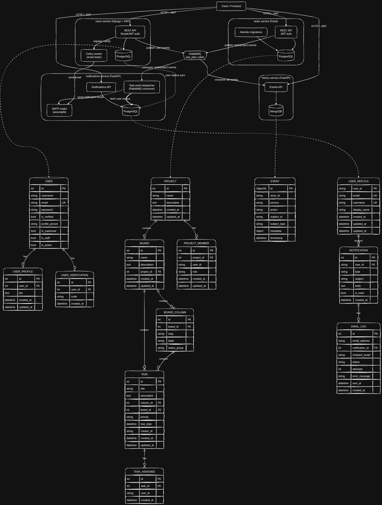

# Project Management System

A portfolio project demonstrating event-driven microservices architecture in Python: four independently deployable services, each built on a different framework, communicating asynchronously over RabbitMQ instead of synchronous service-to-service HTTP calls.

## Table of Contents

- [Overview](#overview)
- [Project Anatomy](#project-anatomy)
- [Architecture & Inter-Service Communication](#architecture--inter-service-communication)
- [Getting Started](#getting-started)
  - [Changing a service's host/port/route](#changing-a-services-hostportroute)
- [Available Commands](#available-commands)
- [Tech Stack](#tech-stack)
- [Testing](#testing)
- [API Documentation](#api-documentation)
- [Release](#release)

## Overview

This system models a Trello/Jira-style project management tool split into four bounded-context services:

| Service | Responsibility | Framework | Database |
|---|---|---|---|
| **users** | Authentication, registration, profiles | Django + DRF | PostgreSQL |
| **tasks** | Projects, boards, columns, tasks, assignments | Flask | PostgreSQL |
| **history** | Immutable audit log of every domain event | FastAPI | MongoDB |
| **notifications** | Email notifications for task/project activity | FastAPI | PostgreSQL |
| **admin** | Internal dashboard for browsing data across all four services | Vue 3 + Vite | — |

`admin` is a thin operator-facing client, not a bounded-context service in the event-driven sense described below: it talks directly to each service's REST API over plain HTTP to list/inspect records (projects, events, notifications, etc.) and does not publish or consume RabbitMQ events itself.

Rather than services calling each other directly over HTTP, state-changing actions in `users` and `tasks` publish domain events to RabbitMQ. `history` consumes every event to build an audit trail; `notifications` consumes task/project events to email the relevant users. This keeps services independently deployable and decoupled from each other's availability — if `notifications` is down, task creation in `tasks` still succeeds.

## Project Anatomy

```
project_management_system/
├── docker-compose.yaml          # Full stack: 4 services + Postgres, Mongo, Redis, RabbitMQ
├── init-db.sql                  # Creates per-service Postgres databases/users on first boot
├── run-all-tests.sh             # Runs each service's suite + the cross-service integration suite
├── rabbitmq-definitions.json    # Pre-provisioned exchanges/queues for RabbitMQ
├── api_docs/                    # Bruno API collection (see note below)
├── pms_design.excalidraw        # Architecture diagram source
├── tests/
│   └── integration/             # Host-side black-box tests crossing real service boundaries
└── services/
    ├── users/                   # Django + DRF — auth, registration, profiles
    │   ├── users/                # Django project settings, celery app, wsgi/asgi
    │   ├── accounts/              # Django app: models, views, serializers, tests
    │   └── manage.py
    ├── tasks/                   # Flask — projects, boards, tasks
    │   ├── app/
    │   │   ├── apis/              # Route blueprints
    │   │   ├── models/            # SQLAlchemy models
    │   │   ├── services/          # Business logic
    │   │   ├── schemas/            # Request/response (de)serialization
    │   │   └── security/           # JWT + role-based permissions
    │   ├── alembic/               # DB migrations
    │   └── alembic_migration_entrypoint.sh
    ├── history/                  # FastAPI — event log
    │   └── app/
    │       ├── models/             # Beanie (MongoDB ODM) documents
    │       ├── consumers/          # RabbitMQ consumer entrypoint
    │       └── apis/
    ├── notifications/            # FastAPI — email notifications
    │   └── app/
    │       ├── models/             # SQLModel models
    │       ├── dispatchers/        # Maps incoming events -> notification templates
    │       ├── templates/           # Notification content dataclasses
    │       ├── consumers/           # RabbitMQ consumer entrypoint
    │       └── services/
    └── admin/                    # Vue 3 + Vite — read-only dashboard over the other services' APIs
        └── src/
            ├── views/              # One folder per service (tasks_service, events_service, notifications_service)
            ├── components/         # Shared Navbar, Table
            └── router.js           # Routes + navbar nav items (see .env.example for endpoint config)
```

Each service is a self-contained Python project with its own `requirements.txt`, `Dockerfile`, `.env`, and `tests/` — there is no shared runtime dependency between them, only the shared RabbitMQ broker and a shared JWT signing secret for auth.

## Architecture & Inter-Service Communication

[](./pms_design.drawio)

**Authentication:** all four services validate the same JWT (signed with a shared `JWT_SECRET_KEY`), so a token issued by `users` on login is accepted directly by `tasks`, `history`, and `notifications` without a network round-trip back to `users`.

**Event flow:** `users` and `tasks` publish domain events (e.g. `task.create`, `project.member_add`) to RabbitMQ using a Celery-style task envelope (`{"task": ..., "id": ..., "args": [payload]}`). `history` consumes every event unconditionally to build an audit trail; `notifications` consumes only task/project events it has a template for, builds an email via its dispatcher, and sends it through its SMTP mailer.

**Resilience:** message redelivery/retry is handled via [Stamina](https://github.com/hynek/stamina) rather than a dead-letter exchange.

## Getting Started

### Prerequisites
- Docker & Docker Compose
- Python 3.12+ (only needed to run the host-side integration suite)

### 1. Configure environment variables

Each service ships an `.example.env` — copy it to `.env` in the same directory and fill in real values (SMTP credentials, JWT secret, etc.):

```bash
cp .example.env .env
cp services/users/.example.env services/users/.env
cp services/tasks/.example.env services/tasks/.env
cp services/history/.example.env services/history/.env
cp services/notifications/.example.env services/notifications/.env
cp services/admin/.env.example services/admin/.env
```

> All four backend services must share the same `JWT_SECRET_KEY` value — cross-service auth depends on it.
> `services/admin/.env` holds the base URL for each service's API (see [Changing a service's host/port/route](#changing-a-services-hostportroute) below) — it's a Vite frontend, so it uses `.env`/`.env.example` rather than the backend services' `.example.env` convention.

### 2. Bring up the stack

```bash
docker compose up -d --wait
```

This starts PostgreSQL, MongoDB, Redis, and RabbitMQ, then all four services plus their background workers (`celery_users_worker`, `history-worker`, `notifications-worker`). Postgres provisions a separate database per service on first boot via `init-db.sql`; `users` and `tasks` also run their own migrations (Django migrations / Alembic) automatically on container start.

### 3. Create the first Django superuser

```bash
docker compose exec users-service python manage.py createsuperuser
```

Follow the prompts for email, username, and password. This account can authenticate against all four services once the JWT it receives is used as the bearer token, and has `is_superuser` privileges reflected in that token's claims (used by superuser-gated endpoints, e.g. listing all notifications).

### 4. Verify

| Service | URL |
|---|---|
| users | http://localhost:8000 |
| tasks | http://localhost:8080/docs |
| history | http://localhost:5006/docs |
| notifications | http://localhost:8081/docs |
| RabbitMQ management UI | http://localhost:15672 (guest/guest) |
| admin panel | http://localhost:5173 (run separately, see below) |

### 5. Run the admin panel

The admin panel isn't in `docker-compose.yaml` yet — run it directly with Node:

```bash
cd services/admin
npm install
npm run dev
```

### Changing a service's host/port/route

`services/admin` reads one base URL per backend service from `services/admin/.env` — each view appends its own path on top:

| Env var | Used by | Default |
|---|---|---|
| `VITE_AUTH_API_URL` | `LoginView.vue`, `http.js` (token refresh) | `http://localhost:8000` |
| `VITE_TASKS_API_URL` | `views/tasks_service/*` | `http://localhost:8080` |
| `VITE_EVENTS_API_URL` | `views/events_service/*` (history service) | `http://localhost:5006` |
| `VITE_NOTIFICATIONS_API_URL` | `views/notifications_service/*` | `http://localhost:8081` |

If a service's host, port, or base path changes (e.g. a different `docker-compose` port mapping, or a reverse proxy in front of it in another environment), update the corresponding var in `services/admin/.env` and restart the Vite dev server (`npm run dev`) — env vars are inlined at build/dev-server start, so a running server won't pick up a `.env` edit. No application code needs to change. `services/admin/.env.example` documents the same vars and should be kept in sync when a new backend service gains an admin view.

Admin-panel navigation (which links/dropdowns appear in the navbar) is driven by `navItems` in `services/admin/src/router.js`, not by the `.env` file — adding a new view means adding a route + a `navItems` entry there, in addition to any new env var for its service's base URL.

## Available Commands

```bash
# Bring the whole stack up / down
docker compose up -d --wait
docker compose down

# View logs for a specific service
docker compose logs -f tasks-service

# Run every service's test suite + the cross-service integration suite
bash run-all-tests.sh

# Run specific suites only
bash run-all-tests.sh users tasks
bash run-all-tests.sh integration

# Bring the stack up first, then run everything
bash run-all-tests.sh --up

# Django management commands (users service)
docker compose exec users-service python manage.py migrate
docker compose exec users-service python manage.py createsuperuser
docker compose exec users-service python manage.py test

# Alembic migrations (tasks service) — normally run automatically on container start
docker compose exec tasks-service alembic upgrade head
docker compose exec tasks-service alembic revision --autogenerate -m "message"
```

## Tech Stack

**Frameworks**
- [Django](https://www.djangoproject.com/) + [Django REST Framework](https://www.django-rest-framework.org/) + [SimpleJWT](https://django-rest-framework-simplejwt.readthedocs.io/) — `users`
- [Flask](https://flask.palletsprojects.com/) + [Flask-JWT-Extended](https://flask-jwt-extended.readthedocs.io/) + [SQLAlchemy](https://www.sqlalchemy.org/) + [Alembic](https://alembic.sqlalchemy.org/) — `tasks`
- [FastAPI](https://fastapi.tiangolo.com/) + [Beanie](https://beanie-odm.dev/) — `history`
- [FastAPI](https://fastapi.tiangolo.com/) + [SQLModel](https://sqlmodel.tiangolo.com/) — `notifications`

**Databases & Infrastructure**
- PostgreSQL — `users`, `tasks`, `notifications` (one database per service)
- MongoDB — `history` (document store for the append-only event log)
- Redis — Celery result/broker backend for `users`
- RabbitMQ — inter-service event bus
- [Stamina](https://github.com/hynek/stamina) — retry policy for message consumers

**Other**
- Celery — async email delivery in `users`
- `aio_pika` / `pika` — RabbitMQ clients
- `aiosmtplib` — async SMTP client in `notifications`

## Testing

The suite follows a three-layer convention applied consistently across all four services:

- **`tests/unit/`** — pure logic, all persistence and I/O mocked.
- **`tests/feature/`** — routes exercised end-to-end against a real (throwaway) database: SQLite in-memory for `tasks`/`notifications`, a scratch Mongo database for `history`, Django's test database for `users`.
- **`tests/integration/`** (repo root) — host-side black-box tests that drive real HTTP endpoints against the real RabbitMQ broker and poll the consuming service's read API, proving that a message one service publishes is actually delivered and acted on by another.

Run everything with:

```bash
docker compose up -d --wait
bash run-all-tests.sh
```

> Some integration tests send real email through the configured SMTP account (e.g. registering a user, adding a project member). These are marked `@pytest.mark.smtp` and excluded by default.

## API Documentation

[](https://fetch.usebruno.com?url=git%40github.com%3AYoussefIbraheem%2Fproject-management-system.git "target=_blank rel=noopener noreferrer")

Each FastAPI service exposes interactive OpenAPI docs at `/docs`; `tasks` (Flask) exposes the same via `swagger_ui` at `/docs`. A [Bruno](https://www.usebruno.com/) collection is also maintained under `api_docs/` for manual exploration and end-to-end request flows across services.

## Release

**v0.2.0** — added `admin`, a Vue 3 dashboard covering the services that lacked one (`history` events, `notifications` notifications/user-replicas/email-logs); navbar navigation replaces a per-service sidebar, with hover dropdowns for services with multiple views; all cross-service API base URLs moved out of view code into `services/admin/.env` (see [Changing a service's host/port/route](#changing-a-services-hostportroute)).

**v0.1.0** — initial public release: all four services implemented and integration-tested, non-root Docker images, full test pyramid in place.
